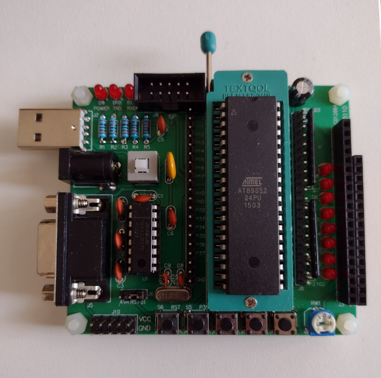

# C51/AVR Devboard 

* ISP header on Port 1 
* A102J 1k resistor pack on Port 0
* A103J 10k resistor pack on Port 2
* D1 - D8 LED on 8051 P2.1 - P2.8 (pins 20 - 27)
* 1602 LCD interface plug on Ports 1 & 2
* 12864 LCD plug on Ports 1 & 2
* MAX232EPE RS232 converter on Port 3
* Buttons: RST, S2 - S5 on pins 32-35
