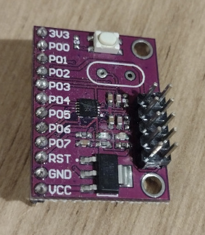

# CJMCU-8051

Small development board with C8051F300 chip.

## Toolchain

SDCC includes a header for this chip.

/usr/share/sdcc/include/mcs51/C8051F300.h

### Programming

Chip uses the Si Labs C2 Interface (2‑wire debug/programming protocol)

## References

[Data Sheet](https://www.silabs.com/documents/public/data-sheets/C8051F30x.pdf)
