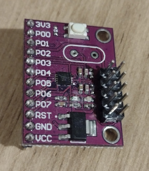
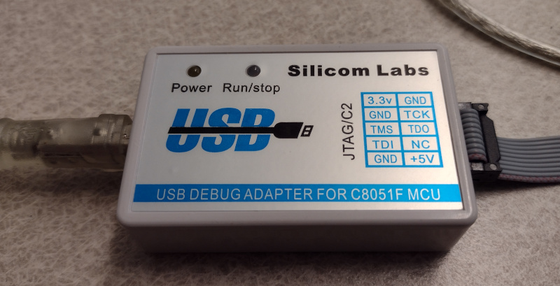

# CJMCU-8051

Small development board with C8051F300 MCU



## MCU Specs

* 25 Mhz core
* 8K Flash
* 3 Timers
* UART, SPI, I2C
* GPIO Port 0
* Comparator
* Some versions have ADC/Temp (F300/2)
* Si C2 Debug interface
* GPIO is 5V tolerant
* Crossbar pin configuration

## Board Description

* 3.3V Regulator
* Debug Header
* Reset Button
* XTAL footprint
* User LED (red) on P0.0

## Toolchain

SDCC includes a header for this chip.

```bash
/usr/share/sdcc/include/mcs51/C8051F300.h
```

### Programming

Uses the Si Labs C2 Interface (2‑wire debug/programming protocol)

**Notch oriented to the left on programming header**



## References

* [SiLabs C8051F30x Data Sheet](https://www.silabs.com/documents/public/data-sheets/C8051F30x.pdf)
* [Linux EC2 Debugger Support](https://github.com/paragonRobotics/ec2-new)
