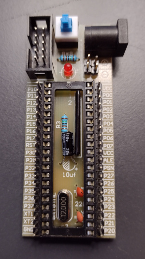
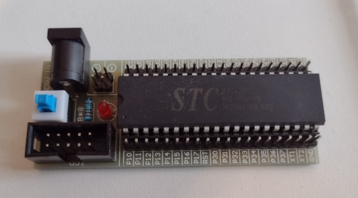

# STC Micro 89C52RC

8052 compatible derivative with serial EEPROM.




This mimumum development board came as a kit from ebay.

It has a 12 Mhz crystal which skews the baud rate a little.

## Board Pinouts

Connect USB serial:

* Red and Black to +/- pins at power connector
* White to P3.0
* Green to P3.1

## Toolchain

SDCC does not appears to have a header specific to this device.

```
#include <mcs51/8051.h>
```

### Programming

These chips have a USB/UART boot strap loader (BSL) that can be programmed via the Linux [stcgal utility](https://github.com/grigorig/stcgal).

```
./stcgal.py -b 9600 /tmp/hex/blinky.hex
```
<pre>
(.venv) steve@kitsap:~/GITHUB/stcgal$ ./stcgal.py -b 9600 /tmp/hex/blinky.hex 
Waiting for MCU, please cycle power: done
Protocol detected: stc89
Target model:
  Name: STC89C52RC/LE52RC
  Magic: F002
  Code flash: 8.0 KB
  EEPROM flash: 6.0 KB
Target frequency: 11.907 MHz
Target BSL version: 3.2C
Target options:
  cpu_6t_enabled=False
  bsl_pindetect_enabled=False
  eeprom_erase_enabled=False
  clock_gain=high
  ale_enabled=True
  xram_enabled=True
  watchdog_por_enabled=False
Loading flash: 26 bytes (Intel HEX)
Switching to 9600 baud: checking setting testing done
Erasing 2 blocks: done
Writing flash: 640 Bytes [00:00, 1108.90 Bytes/s]                                                                                                                                                   
Setting options: done
Disconnected!
</pre>


## References

* [STC89Cxx Data Sheet](https://www.stcmicro.com/datasheet/STC89C51RC-en.pdf)
* [stcgal](https://github.com/grigorig/stcgal)
