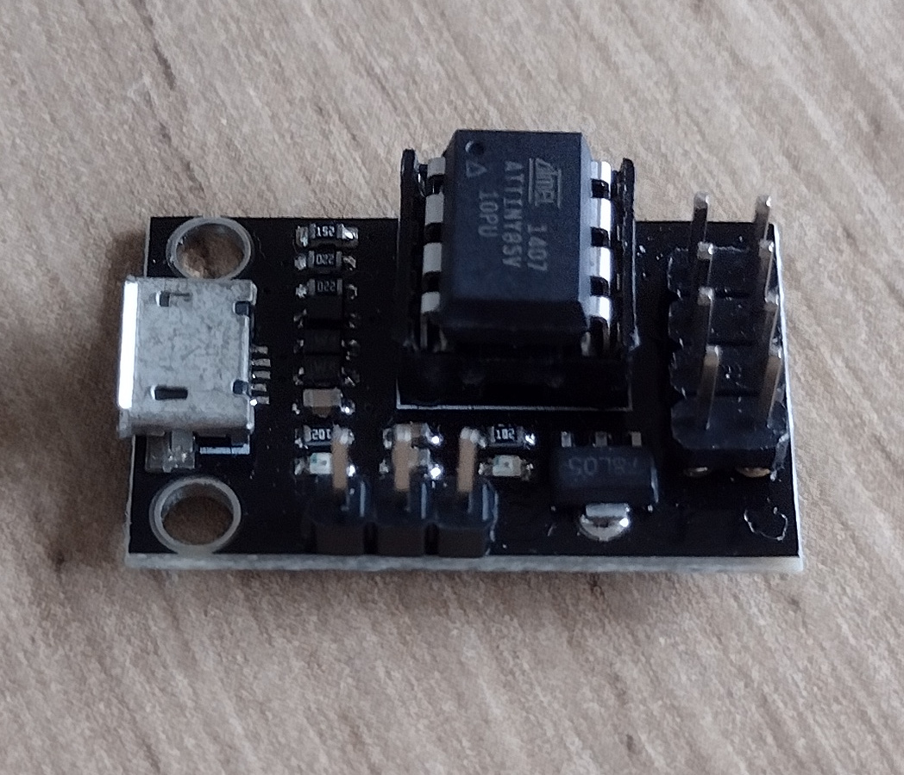

# Digispark / ATTiny Core

I have several of these boards.

The Arduino [ATTiny Core](https://github.com/SpenceKonde/ATTinyCore) is available on Github.

The URL can be added to 'additional board managers' via File->Preferences in Arduino IDE.

## Bootloaders

The essential components of these cores is the serial bit-bang bootloader.

The development board came with no microcontroller installed. I added my own. Still needs bootloader.
