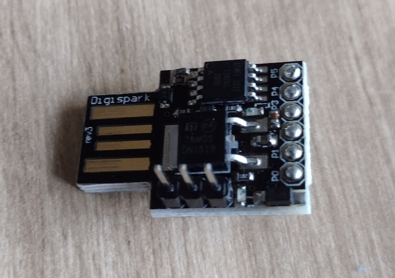

# Digispark / ATTiny Core

I have several of these boards.

The Arduino [ATTiny Core](https://github.com/SpenceKonde/ATTinyCore) is available on Github.

The URL can be added to 'additional board managers' via File->Preferences in Arduino IDE.

## Bootloaders

The ATTiny 85 series does not have any hardware bootloader support. The various bootloaders
share space with the user program. Also, the devices do not have USB hardware support so this
is implemented in code as well.

### Micronucleus

The [Micronucleus Bootloader](https://github.com/micronucleus/micronucleus/tree/v1.11) is/was
the original bootloader for the Digispark devices. It is built around emulating a USB device
in code for programming.

### Optiboot

The [Optiboot Bootloader](https://github.com/Optiboot/optiboot) uses serial communication and requires
a USB-serial converter.

The bootloaders will be available to install via the board support packages in the Arduino IDE.

## Programming

My Digispark is about 10 years old. Works with Arduino ATTiny Core: Board (Attiny 85 / Micronucleus). Set programmer type to Micronucleus.
