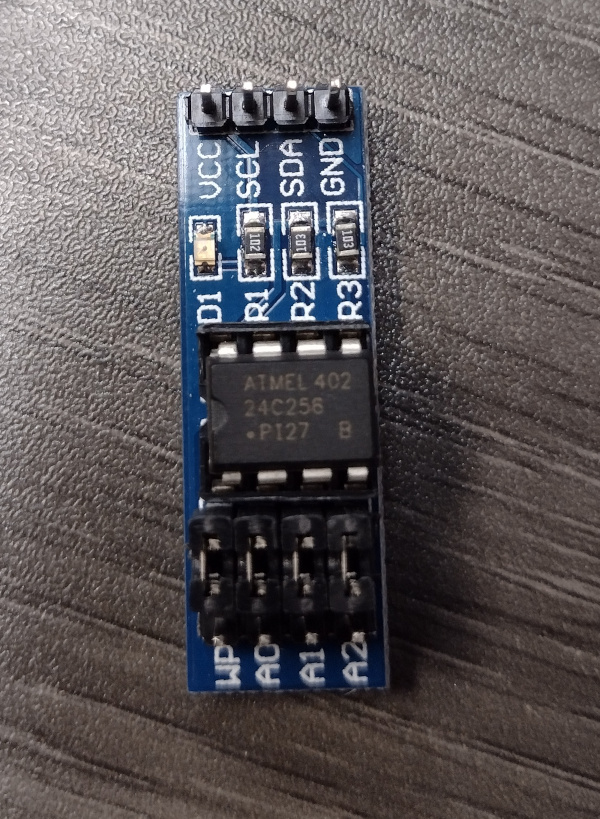

# Atmel AT24Cxx i2c Serial EEPROMs

8-pin serial eeproms in sizes 128 bytes - 512k. Addressing pins for cascading multiple chips.

## AT24C256 EEPROM Module

Atmel AT24C256 (256KB) i2C EEPROM breakout board.

Pinout

* 1,2,3: A0, A1, A2 i2c address select
* 4: GND
* 5: SDA
* 6: SCL
* 7: WP (write protect)
* 8: VCC

## AT24C32

32k chip onboard DS1307 module.

## Example Code

Many example with Wire library or more chip specific libraries that support page writes, etc.

## References

* [AT24C256 Datasheet](https://ww1.microchip.com/downloads/en/DeviceDoc/Atmel-8568-SEEPROM-AT24C256C-Datasheet.pdf)
* [AT24C256 Arduino Library](https://docs.arduino.cc/libraries/at24c256-library/)
* [AT24Cxx Arduino Library](https://github.com/stefangs/arduino-library-at24cxxx)
