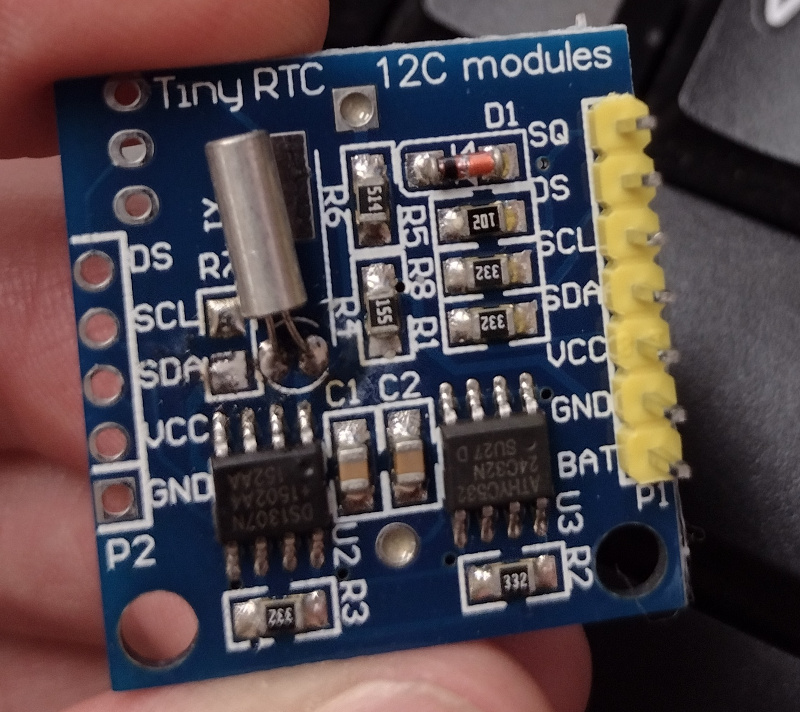

# Arduino Sketches

Sketches for:

* Arduino Uno R3
* Arduino Pro Mini
* Arduino Nano
* [Adafruit Trinket](../trinket)
* [Digispark](DIGISPARK.md)

## Modules

* DS1307 real time clock
* HD44780 LCD
* BMP180 barometer & temp
* INA219 DC current sensor
* MCP3008 ADC
* MCP4725 12-bit DAC
* ADS1015 12-bit ADC
* ADS1115 16-bit ADC
* I2C EEPROM
* DS18B20 1-wire temperature
* HX1838 IR
* I2C 7-segment backpack
* I2C/SPI mini LCD
* PN532 NFC RFID
* [TEA5767 FM Tuner](tea5767)
* [SC16IS650 I2C/SPI to UART](https://www.nxp.com/docs/en/data-sheet/SC16IS740_750_760.pdf)
* [CH375B USB Drive Reader](http://www.bitsavers.org/components/wch/_dataSheets/CH375.PDF)
* 250V AC / 30V DC relay module
* [HC-06 Bluetooth Module](https://github.com/dennistreysa/HC-06-BT)
* Voltage Divider / Sensor
* 16 key membrane keypad
* ACS712 5A current sensor
* Rotary Encoder
* 0.96" OLED
* LM393 reed sensor module
