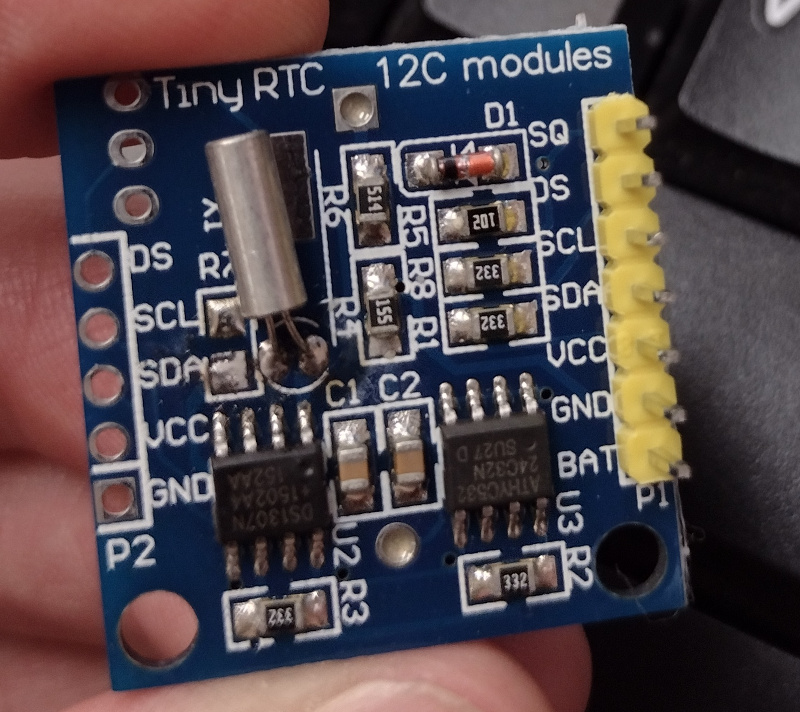

# Arduino Test Sketches

Test programs and example code for my collection of peripheral boards.

## Peripherals

* DS1307 real time clock
* HD44780 LCD
* BMP180 barometer & temp
* INA219 DC current sensor
* MCP3008 ADC
* MCP4725 12-bit DAC
* ADS1015 12-bit ADC
* ADS1115 16-bit ADC
* I2C EEPROM
* DS18B20 1-wire temperature
* HX1838 IR
* I2C 7-segment backpack
* I2C/SPI mini LCD
* PN532 NFC RFID
* TEA5767 FM Tuner
* SC16IS650 I2C/SPI to UART
* CH375B USB Drive Reader
* 250V AC / 30V DC relay module
* HC-06 Bluetooth Module
* Voltage Divider / Sensor
* 16 key membrane keypad
* ACS712 5A current sensor
* Rotary Encoder
* 0.96" OLED
* LM393 reed sensor module

## References

* [Arduino Wire Library](https://docs.arduino.cc/language-reference/en/functions/communication/wire)
