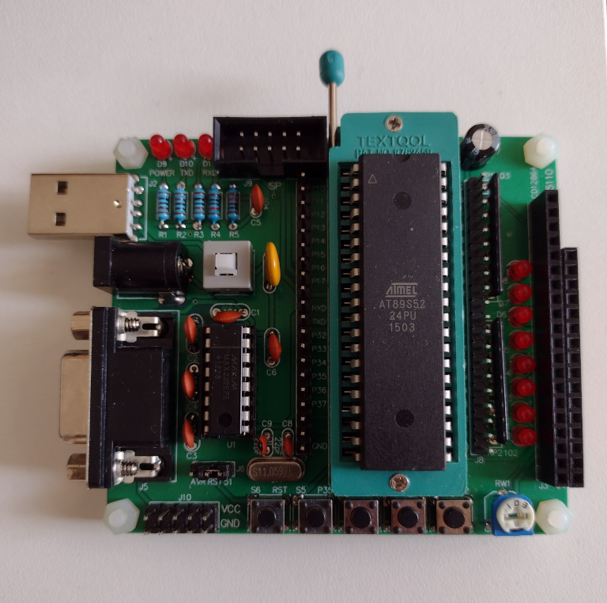

# Atmel AT89S52

This version of the Atmel AT89 series supports In-System Programming (ISP) to Flash memory.

<a href="https://www.keil.com/dd/docs/datashts/atmel/at89s52_ds.pdf">AT89S52 Datasheet</a>

My chips are in the 40 pin PDIP format.

## Development Boards

I purchased this development board from ebay as a kit.

<a href="DEVBOARD.md">Board Info</a>

I have another small one somewhere that also came as a kit.

## Programming

I was able to program the chips with the 'Willar programmer' obtained from ebay. The software is 
Willar Programmer V2.2 and runs under Windows.

This chip can apparently also be programmed via AVRDude with some modifications. Need to research.

The development board shown above has a plug for an ISP programming cable.
