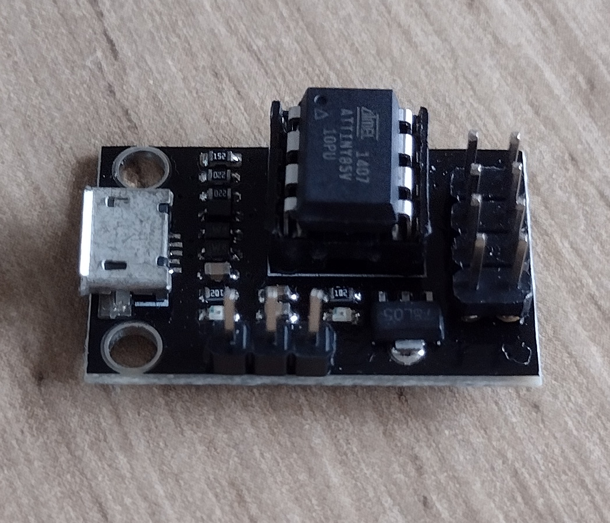

# ATTiny 24/45/85

Tiny microcontroller.

My samples:

* ATTiny45
* ATTiny85V

This board is also known as the HW-260 development board.

## Programming

Pin 1: Reset
Pin 4: GND

Pin 8: VCC
Pin 7: SCK
Pin 6: MISO
Pin 5: MOSI

Programming a bare chip with cw_blinker via USBASP is successful.

### Bootloader

Programming an ATTiny85 with micronucleus bootloader vi USBASP.

