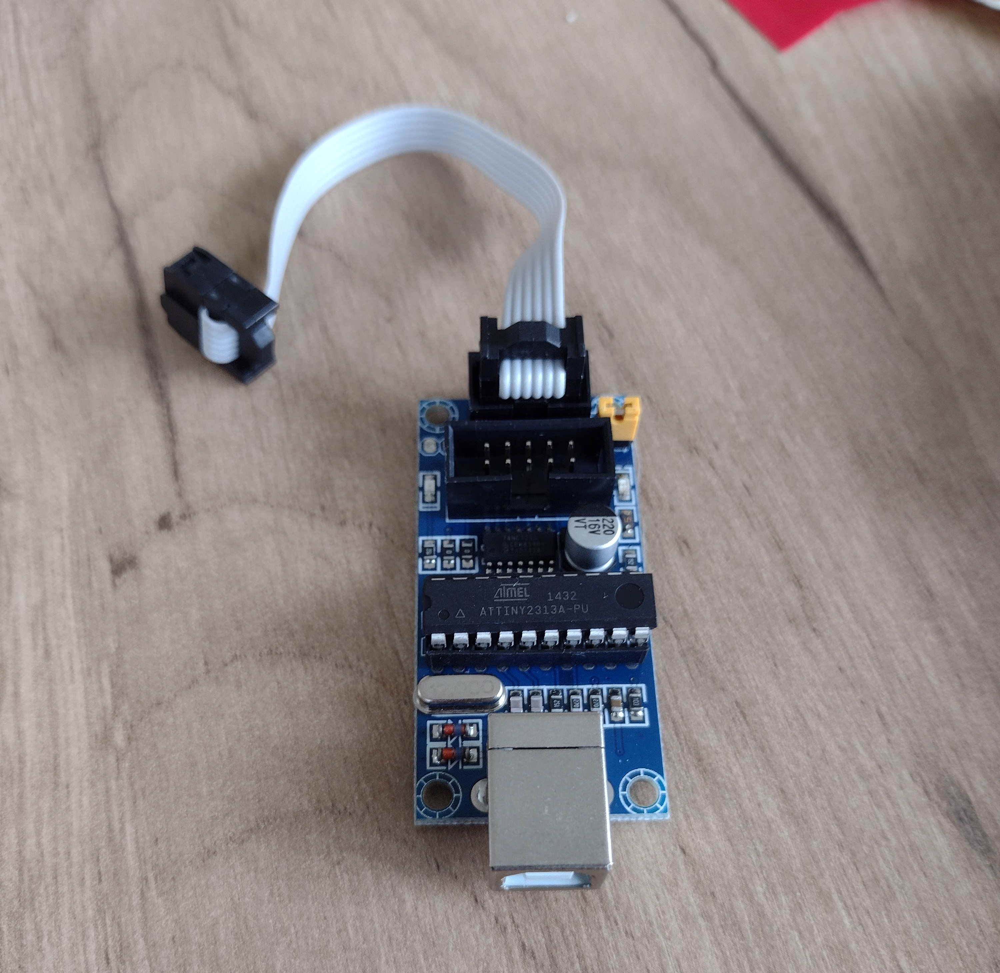

# AVR Programmer USBtinyisp

Open source AVR programmer.



```bash
avrdude -c usbtiny
```

Not sure what firmware mine has. Adafruit clone?

## References

* [USBTinyISP Adafruit Project](https://learn.adafruit.com/usbtinyisp/overview)
