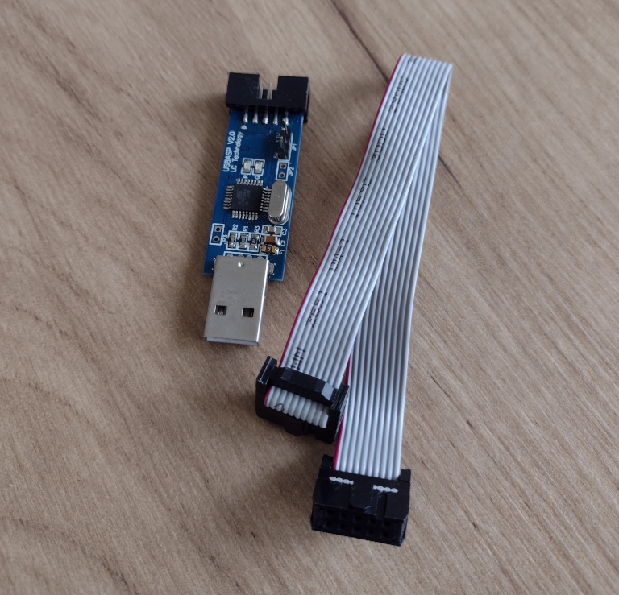

# USBASP V2.0 Programmer

Small programmer, works with avrdude.



I have a little adapter board to connect it to the arduino 6 pin ICSP.


## UDEV rules

Must be run as root or usb device configured for user access.

<pre>
Bus 002 Device 017: ID 16c0:05dc Van Ooijen Technische Informatica shared ID for use with libusb
</pre>

Create a udev rule: Create a file /etc/udev/rules.d/98-usbasp.rules (or similar)

Add line:

```
SUBSYSTEM=="usb", ATTRS{idVendor}=="16c0", ATTRS{idProduct}=="05dc", MODE="0660", GROUP="dialout"
```

and reload udev rules:

```
sudo udevadm control --reload-rules 
sudo udevadm trigger
```

## Programming

Test connectivity:

```
root@kitsap:~# avrdude -p m328p -c usbasp
```

Makefile has some examples.

To upload a sketch using the USBASP, select Sketch->Upload Using Programmer from the Arduino IDE menu.

## References
