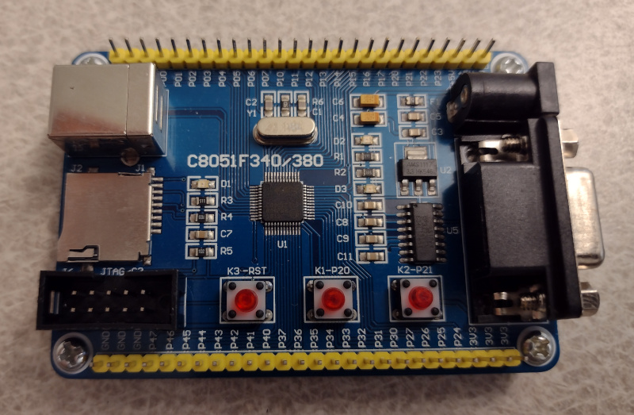
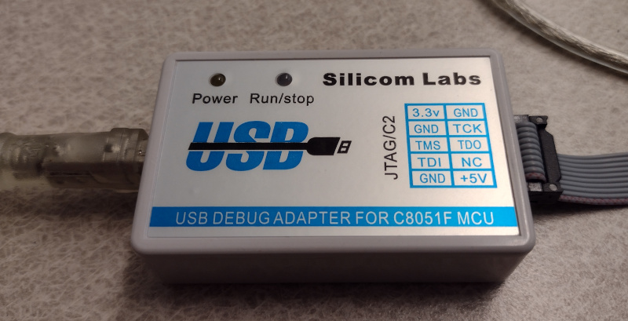

# C8051F Series Microcontroller

Silicon Labs 8051 core microcontrollers in small form factors with 16K flash.

## C8051F340/380 Development Board

This board is availble on eBay with the following features:

* C8051F340-B-GQ
* USB port
* sdcard slot
* 3 pushbuttons
* DB9 serial port and level converter

## Development Tools

[Simplicity Studio](https://www.silabs.com/software-and-tools/simplicity-studio) is the main SiLabs development suite for these devices. It is available for Windows and Linux
I was able to get this installed and detecting the debug adapter and board.

Basic support is provided by SDCC: /usr/share/sdcc/include/mcs51/C8051F340.h

Some [code examples](https://github.com/merbanan/C8051F300_examples) are available in github.

## Programming via JTAG / C2 USB Adapter

This is a cheap clone that supports JTAG and C2 protocol.

It is supported by the [ec2drv-new library](https://github.com/paragonRobotics/ec2-new.git) 

Note: build library with cmake.

<pre>
Bus 002 Device 011: ID 10c4:8044 Silicon Labs USB Debug Adapter
</pre>

## References

* [SiLabs C8051F31x](https://www.silabs.com/mcu/8-bit-microcontrollers/c8051f31x)
* [C8051F340 Datasheet](https://www.silabs.com/documents/public/data-sheets/C8051F34x.pdf)
* [Colecovision.eu tutorial](http://www.colecovision.eu/mcs51/C8051F340%20380%20Serial.shtml)
* [Code Examples](/usr/share/sdcc/include/mcs51/C8051F340.h)
