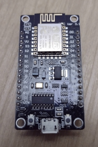
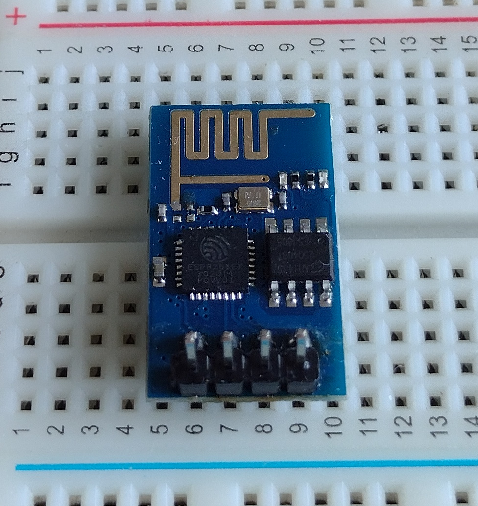
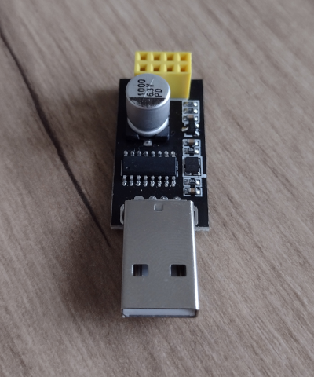

# ESP8266

Espressif Systems L106 32 bit microcontroller with WiFi accessed by AT commands.

Can be programmed with:

* Arduino
* Non-OS SDK
* RTOS SDK

## Boards

### NodeMCU

Arduino board support.

### ESP-01 Modules

I have several ESP8266-01 boards.

Espressif Systems <a href="https://en.wikipedia.org/wiki/ESP8266">microcontroller</a> with WiFi.

There is also a USB serial plug-in adapter available for it based on the CH340 chip.

<pre>
Bus 002 Device 005: ID 1a86:7523 QinHeng Electronics CH340 serial converter
</pre>

Note: This serial converter doesn't have a way to put the ESP8266 into programming mode. Needs
button to pull GPIO0 to ground. A separate button can pull RST to ground for restart. Need to make a little board
for this. 

More info at [Maker Advisor](https://makeradvisor.com/esp8266-esp-01-usb-serial-programmer)

The pinout is shown below:

## Development Tools

* Arduino IDE with correct board support package.
* Platform IO

## Weather Station Project

Todo: bmp180, humidity sensor on nodemcu to MQTT.

