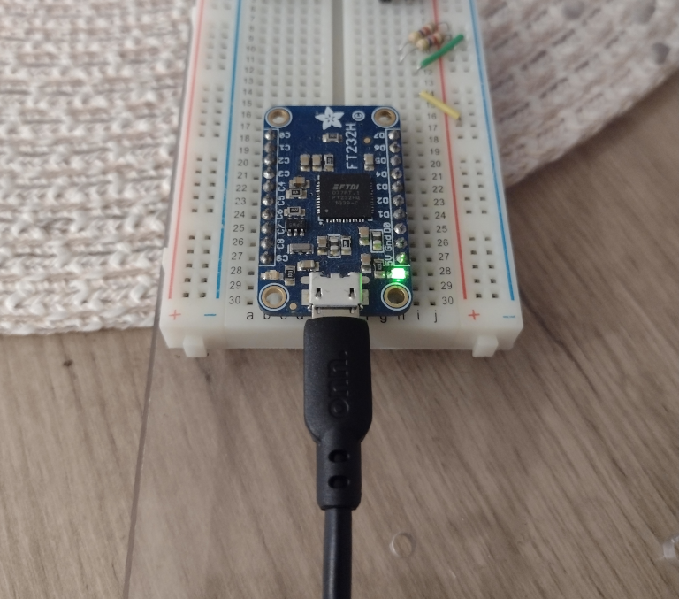

# Adafruit FT232H Breakout Board

My device is an older FT232H with a micro USB connector.



```
Bus 002 Device 005: ID 0403:6014 Future Technology Devices International, Ltd FT232H Single HS USB-UART/FIFO IC
```

## Adafruit Blinka library setup

The following is the setup process on Debian Bookworm.

1. Install pyftdi library, one which Blinka depends.

```
sudo apt install python3-ftdi
```

2. Add the relevant lines to /etc/udev/rules.d/11-ftdi.rules depnding on your device.

```
SUBSYSTEM=="usb", ATTR{idVendor}=="0403", ATTR{idProduct}=="6001", GROUP="plugdev", MODE="0666"
SUBSYSTEM=="usb", ATTR{idVendor}=="0403", ATTR{idProduct}=="6011", GROUP="plugdev", MODE="0666"
SUBSYSTEM=="usb", ATTR{idVendor}=="0403", ATTR{idProduct}=="6010", GROUP="plugdev", MODE="0666"
SUBSYSTEM=="usb", ATTR{idVendor}=="0403", ATTR{idProduct}=="6014", GROUP="plugdev", MODE="0666"
SUBSYSTEM=="usb", ATTR{idVendor}=="0403", ATTR{idProduct}=="6015", GROUP="plugdev", MODE="0666"
```

3. Install blinka in a Pyton virtual environment. Bookworm does not seem to allow pip installs. Is blinka available in an apt repository?
```
python -m venv mydir
mydir/bin/pip3 install blinka
```

4. Export shell variable

```
export BLINKA_FT232H=1

```

5. Wire circuit with bus lines and pullup resistors

There are two versions of this board with slightly different pinouts. Mine is the older version.

A complete description is available at the <a href="https://learn.adafruit.com/circuitpython-on-any-computer-with-ft232h/pinouts">Adafruit FT232H page</a>.


For i2C mode pins D1 and D2 must be tied together.

Output pins can sink or source a maximum of 16 mA.

A <a href="https://cdn-learn.adafruit.com/downloads/pdf/adafruit-ft232h-breakout.pdf">PDF manual</a> is available.

The chip has two modes: UART and MPSSE. It can only be in one mode at a time.

The Blinka library uses the <a href="https://eblot.github.io/pyftdi/gpio.html">pyftdi library</a>.

Todo: Using pyftdi directly, without blinka.

## i2c Pullups

4.7k (Yellow-Violet-Red)

SDA/SCL to 5v

## GPIO Example

470 Ohm (Yellow-Violet-Brown)
1k Ohm (Brown-Black-Red)

5v / 1k Ohm = 5 mA LED current

5v / 470 Ohm = 10.6 mA LED current
