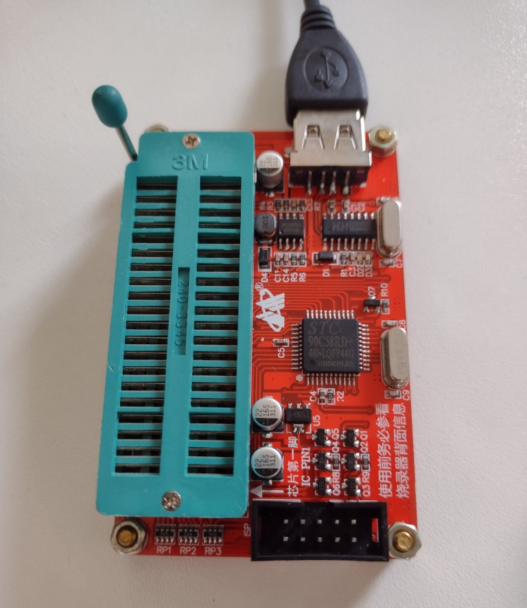

# Atmel AT89S52

This version of the Atmel AT89 series supports In-System Programming (ISP) to Flash memory.

My chips are in the 40 pin PDIP format.

## Programming

I was able to program the chip with an SP200S ebay programmer.

The software is Willar Programmer V2.2 and runs under Windows 10.

This chip can apparently also be programmed via AVRDude with some modifications. 

The development board shown above has a plug for an ISP programming cable.

## Datasheets

* [AT89S52 Datasheet](https://www.keil.com/dd/docs/datashts/atmel/at89s52_ds.pdf")
