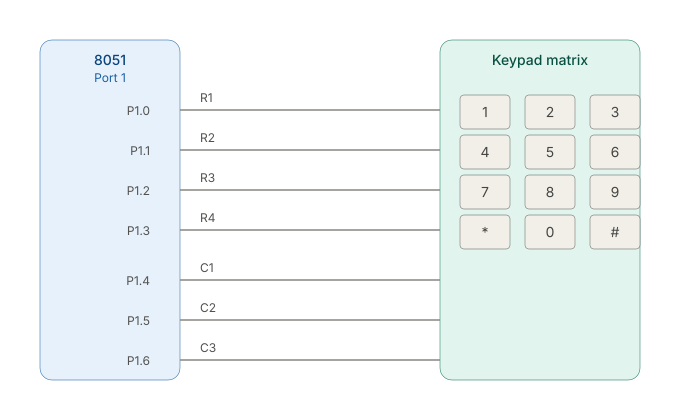

# 8051 Keypad Code

Rows connect straight across to the switches; when a key is pressed, that row line gets shorted to a column line.

Scanning sequence

1. Make all columns inputs with pull-ups high (idle state = all 1s).
2. Drive one row LOW at a time (others stay HIGH).
3. Read the columns. If a column reads LOW, the key at that row/column intersection is pressed.
4. Repeat for each row, cycling fast enough that it feels instant (a few ms per full scan).
5. Add a short debounce delay (~10–20 ms) after detecting a press, to avoid reading bounce as multiple presses.

Practical considerations

* Pull-ups on columns are essential. P1 on the 8051 has weak internal pull-ups, which is usually enough for a membrane keypad. If presses are unreliable, add external 10kΩ pull-up resistors to each column line.
* Diodes aren't needed for single-key detection, but if you ever want reliable multi-key rollover, add a diode in series with each switch.
* Any port will work (P0, P2, P3), but P0 requires external pull-ups.
* Watch for port conflicts with other connected devices.
