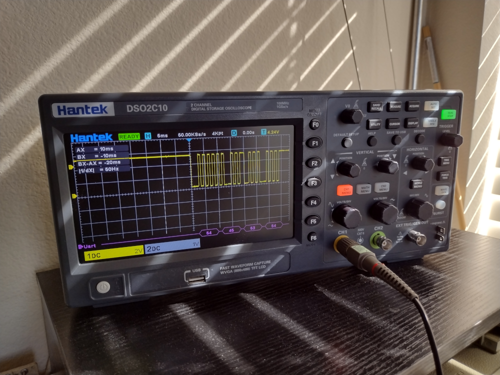

# Software Serial Telemetry

1200 Baud software serial for sending low speed sensor data such as temperature and voltage on an MCU pin.

Written to use 11.059 Mhz crystal and 8052 Timer2.

## Testing

Tested on STC89C52RC mcu.

## References

* [8052.com Tutorial](https://www.8052mcu.com/tut8052)
* [AT89C52RC Data Sheet](https://www.stcmicro.com/STC/STC89C52RC.html)
