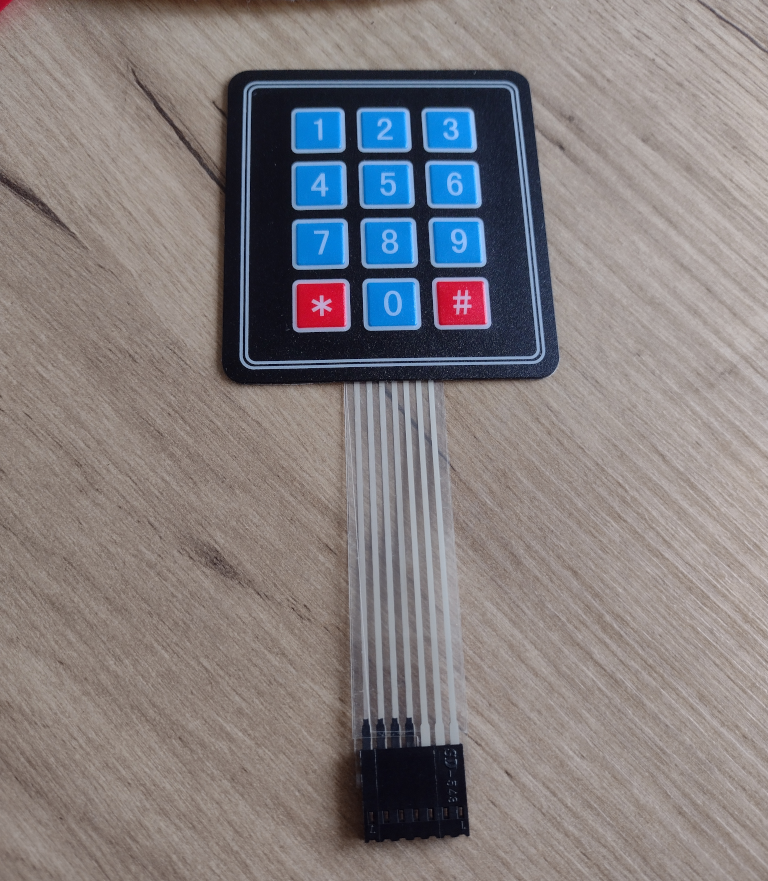

# Adafruit Keypads

These are sold by Adafruit and clones proliferate on ebay.

Adafruit provides a library for Arduino and CircuitPython to perform key scanning.

<pre>
pip3 install adafruit-circuitpython-matrixkeypad
</pre>

## 3x4 keypad model: 419

Numbered left to right, the pins are:

R1, R2, R3, R4, C1, C2, C3

https://www.adafruit.com/product/419

## 1x4 keypad model: 1332

R1, C1, C2, C3

https://www.adafruit.com/product/1332
