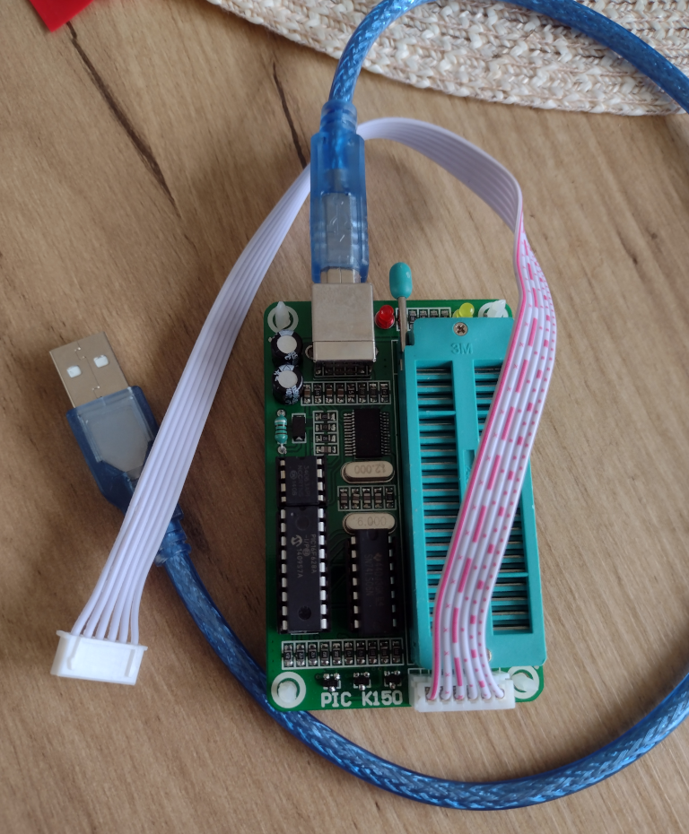

# PIC K150 Programmer

This appears to have been sold by a number of different companies, wtih many clones proliferating on ebay, 
but originally designed by kitsrus. A detailed manual is also available from Future Electronics.

This programmer supports older Microchip Industries 8-bit and 16-bit 
microcontrollers such as:

* PIC12C508
* PIC16C505
* PICF16F873

The full list of supported chips is listed in the manual linked below.

## Documentation

<a href="arpoison.net/bitbucket/k150.pdf">K150.pdf</a>

## Software

This programmer was originally supported under Windows Vista, but was often produced with imitation 
PL2303 chips that are not supported in recent versions of the Windows prolific driver.

The Windows programmer software is called DIYpack25.

Linux support was originally developed circa 2004 and has been re-written and provided at:

https://github.com/Salamek/picpro

I was able to install this via debian apt: 

<pre>

wget -O- https://repository.salamek.cz/deb/salamek.gpg | sudo tee /usr/share/keyrings/salamek-archive-keyring.gpg

echo "deb     [signed-by=/usr/share/keyrings/salamek-archive-keyring.gpg] https://repository.salamek.cz/deb/pub all main" | sudo tee /etc/apt/sources.list.d/salamek.cz.list

sudo apt install python3-picpro

</pre>

Todo:

* Install development tools
* Verify my programmer has correct firmware for this software
* Test program a chip

## Notes

There is a V1 and V2 of this board with minor differences.
