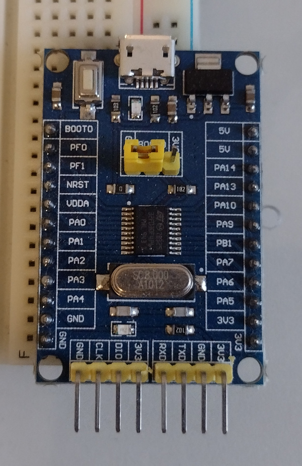

# STM32F030F4P6 Development Board

## MCU

* 48 Mhz CPU
* 16 KB Flash
* 4 KB RAM
* RTC, UART, I2C, API, ADC, GPIO

## Board

* 8 Mhz HSE crystal
* LED on PA4

[Board Diagram](https://www.openimpulse.com/blog/wp-content/uploads/wpsc/downloadables/STM32F030F4P6-Mini-Development-Board-Drawing.jpg)

## Code

* [IOT Sensor Monitor](iot-sensor-monitor) STM32CubeMX Project

## References

* [STM32F030F4 datasheet](https://www.st.com/resource/en/datasheet/stm32f030f4.pdf)
* [STM32F0 CMSIS Github](https://github.com/STMicroelectronics/STM32CubeF0).
