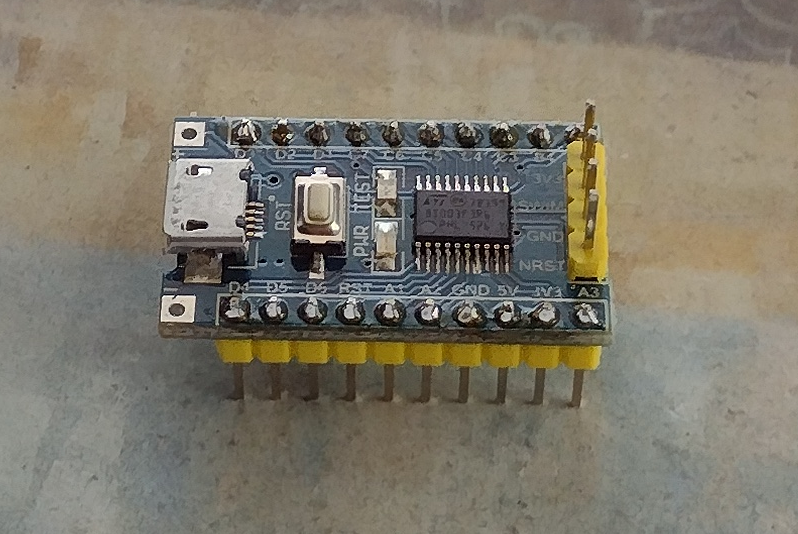

# ST Micro STM8 8-bit microcontroller

16 Mhz Harvard architecture 8-bit MCU.

My device sample is an STM8S003F3P6 (mainstream value line) with the following features:

* 8K flash program memory
* 1K byte RAM
* 128 byte data EEPROM
* UART, SPI i2c
* 3 timers
* ADC
* Interrupt controller 
* Boot ROM
* SWIM debugger

# Architecture and Instruction Set

* 6 registers: X & Y (16 bit indexes), PC (24 bit program counter), SP (16 bit stack pointer), A (8-bit accumulator), CC (8-bit condition code)
* 20 addressing modes
* 80 instructions

* 16 MB linear program space
* 16 MB linear data space

* MUL/DIV Instructions

# Development tools

# Programming

# References

* [STM8 Wikipedia](https://en.wikipedia.org/wiki/STM8)
* [Data Sheet](https://www.st.com/resource/en/datasheet/stm8s003f3.pdf)
* [Programming Guide](file:///home/steve/Downloads/pm0044-stm8-cpu-programming-manual-stmicroelectronics.pdf)

