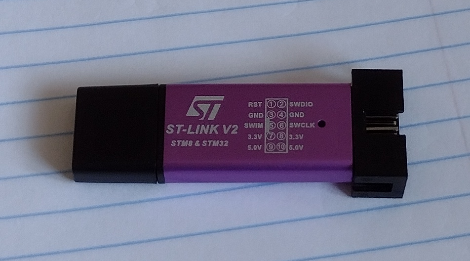

# ST Micro STM8 8-bit microcontroller

16 Mhz Harvard architecture 8-bit MCU.


My device sample is an STM8S003F3P6 (mainstream value line) with the following features:

* 8K flash program memory
* 1K byte RAM
* 128 byte data EEPROM
* UART, SPI i2c
* 3 timers
* ADC
* Interrupt controller 
* Boot ROM
* SWIM debugger
* Test LED on Pin/Port B5

## Architecture and Instruction Set

* 6 registers: X & Y (16 bit indexes), PC (24 bit program counter), SP (16 bit stack pointer), A (8-bit accumulator), CC (8-bit condition code)
* 20 addressing modes
* 80 instructions

* 16 MB linear program space
* 16 MB linear data space

* MUL/DIV Instructions

## Development tools

### STM8 Standard Peripheralis Library (SPL)

* [ST Library](https://my.st.com/content/my_st_com/en/products/embedded-software/mcus-embedded-software/stm8-embedded-software/stsw-stm8069.html)
* [SDCC Patched Library](https://github.com/gicking/STM8-SPL_SDCC_patch)
* [Other version](https://github.com/gicking/STM8-SPL_SDCC_patch)

### ST Visual Develop / ST Assembler-Linker / ST Visual Programmer

Various tools are available for the ST7 & STM8 chips. I have installed ST Visual Develop, which has the [ST Assembler-Linker](https://www.st.com/resource/en/user_manual/um0144-st-assemblerlinker-stmicroelectronics.pdf) as the default tool chain. It supports some other C compilers and toolchains such as Raisonance and Cosmic. The interface is somewhat dated, but I am going
to give it a try. I need to read up a little on the assembler syntax. The IDE is bundled with the ST Visual Programmer application which hopefully will work with my cheap ST-LINK-V2 programmer. 

### Small Device C Compiler (SDCC)

The [SDCC](https://sdcc.sourceforge.net) was used for the C examples here.

## Programming

This device uses the [SWIM protocol](https://www.st.com/resource/en/user_manual/um0470-stm8-swim-communication-protocol-and-debug-module-stmicroelectronics.pdf).

Programming was performed using the [stm8flash tool](https://github.com/vdudouyt/stm8flash). Commands are listed in the Makefile. The data eeprom can
also be written and read using this tool.

```
steve@kitsap:~/GITHUB/microcontrollers/stm8$ stm8flash -c stlinkv2 -p stm8s003f3 -s eeprom -r ee.bin
Determine EEPROM area
STLink: v2, JTAG: v17, SWIM: v4, VID: 8304, PID: 4837
Due to its file extension (or lack thereof), "ee.bin" is considered as RAW BINARY format!
Reading 128 bytes at 0x4000... OK
Bytes received: 128

steve@kitsap:~/GITHUB/microcontrollers/stm8$ xxd ee.bin 
00000000: 4865 6c6c 6f20 576f 726c 6400 0000 0000  Hello World.....
00000010: 0000 0000 0000 0000 0000 0000 0000 0000  ................
00000020: 0000 0000 0053 7465 7665 2c4e 374d 4b4f  .....Steve,N7MKO
00000030: 0000 0000 0000 0000 0000 0000 0000 0000  ................
00000040: 0000 0000 0000 0000 0000 0000 0000 0000  ................
00000050: 0000 0000 0000 0000 0000 0000 0000 0000  ................
00000060: 0000 0000 0000 0000 0000 0000 0000 0000  ................
00000070: 0000 0000 0000 0000 0000 0000 0000 0000  ................
```

### ST-Link V2 clone

Clone ST-Link programmer from ebay. Mine works with ST Visual programmer on Windows and stm8flash on Linux. Wrote strings to eeprom on Windows and read them on Linux.



Pins to connect are: 3V3 (3.3V), SWIM, GND, NRST (RST)

### stlink open source tool

* [stlink open source](https://github.com/stlink-org/stlink)

The [ST Link Open Source](https://github.com/stlink-org/stlink) is available for Linux as well as the [Open On-Chip Debugger](https://openocd.org). Need to test.

## References

* [STM8 Wikipedia](https://en.wikipedia.org/wiki/STM8)
* [Data Sheet](https://www.st.com/resource/en/datasheet/stm8s003f3.pdf)
* [Programming Guide](file:///home/steve/Downloads/pm0044-stm8-cpu-programming-manual-stmicroelectronics.pdf)
* [lujji stm8 bare metal programming](https://lujji.github.io/blog/bare-metal-programming-stm8)
