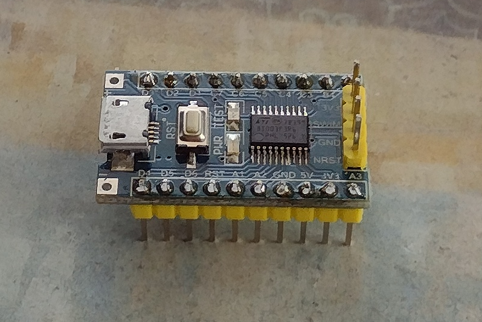

# STM8 development using SDCC and SPL Port

Several small examples in ASM and C.

## STM8S003F3P6 Minimal Development Board



**Board Pins**

* LED: Port B, Pin 5 (shared with i2c)
* UART TX: D5
* UART RX: D6
* I2C SCL: B4
* I2C SDA: B5


## SPL Ports for SDCC

ST Micro SPL is designed for Comisc / Raisonance compilers.

Several ports are avaialble for SDCC:

* [Bruno Schwander Port](https://github.com/bschwand/STM8-SPL-SDCC)
* [Georg Icking-Konert Patch](https://github.com/gicking)

## SDCC

Compiling for STM8

```
sdcc -mstm8 --std-c99 firmware.c
```

SDCC stm8 assmebler is [sdasstm8](https://manpages.debian.org/bookworm/sdcc/sdasstm8.1.en.html)

## Flash Tools

```
stm8flash -c stlinkv2 -p stm8s103 -w firmware.ihx
```
## References

* [ST Micro Product Description](https://www.st.com/en/microcontrollers-microprocessors/stm8s003f3.html)
* [STM8S003F3 Data Sheet](https://www.st.com/resource/en/datasheet/stm8s003f3.pdf)
* [Board Schematic](https://www.openimpulse.com/blog/wp-content/uploads/wpsc/downloadables/STM8S103F3P6-Schematic-Diagram.pdf)
